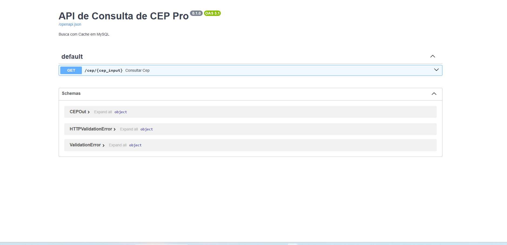
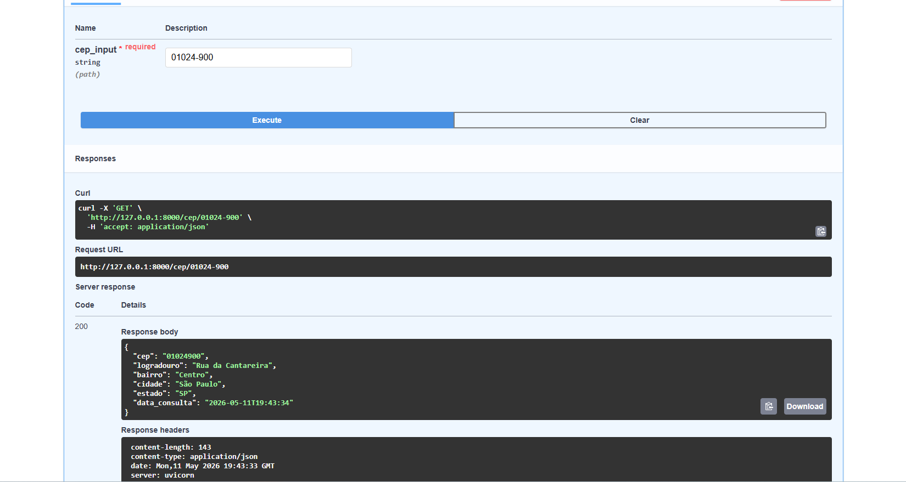

# 📍 API de Consulta e Cache de CEP (FastAPI + MySQL + ViaCEP)


Este projeto demonstra a integração de uma API desenvolvida em **FastAPI** com o serviço externo **ViaCEP**, implementando uma camada de **Cache em MySQL** para otimizar a performance e reduzir chamadas desnecessárias à rede.

## 📌 Funcionalidades Principais

- **Integração com API Externa:** Consumo assíncrono de dados do ViaCEP utilizando a biblioteca `httpx`.
- **Sistema de Cache Local:** Antes de buscar na internet, a API verifica se o CEP já existe no banco de dados MySQL.
- **Persistência Automática:** Novos CEPs consultados são tratados e salvos automaticamente para consultas futuras.
- **Processamento Assíncrono:** Uso de `async/await` para garantir alta performance em operações de I/O.

## 🛠️ Tecnologias e Bibliotecas

- **Linguagem:** Python 3.12
- **Framework:** FastAPI
- **Banco de Dados:** MySQL
- **Cliente HTTP:** HTTPX (Assíncrono)
- **ORM:** SQLAlchemy

## 📸 Demonstração do Projeto

### Consumo de API Externa com Sucesso
Abaixo, a demonstração da consulta de um CEP e o retorno dos dados tratados.



### Histórico de Consultas no MySQL
Os dados são armazenados localmente, reduzindo o tempo de resposta em consultas repetidas.

## 🚀 Como Rodar o Projeto

1. **Clonar o repositório:**
   ```bash
   git clone [https://github.com/seu-usuario/cep-api-fastapi.git](https://github.com/seu-usuario/cep-api-fastapi.git)


2. **Ativar o ambiente virtual e instalar dependências:**
    ```
    .\venv\Scripts\activate
    pip install -r requirements.txt

    ```


3. **Configurar o Banco de Dados:**
    Crie um banco no PostgreSQL chamado `cep_db.`


    Ajuste a string de conexão no arquivo `app/database.py.`


4. **Executar a API:**
    ```set PYTHONPATH=.
    python -m uvicorn app.main:app --reload```

    Acesse: `http://127.0.0.1:8000/docs`


Desenvolvido por [Gustavo Jeronimo] - Conecte-se comigo no LinkedIn: https://www.linkedin.com/in/gustavo-jeronimo/
